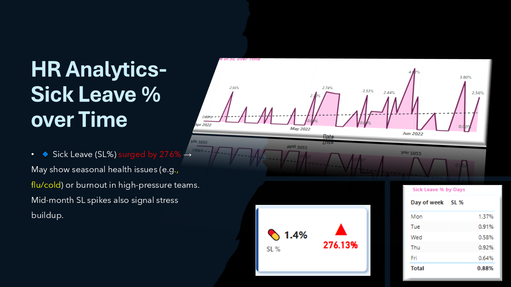

# 🧠 HR Analytics Dashboard – Power BI Project

This project analyzes employee attendance behavior, leave trends, WFH patterns, and sick leave spikes using interactive Power BI visuals. Designed to assist HR teams in monitoring workforce presence and improving operational planning.

---

## 📌 Project Objectives

- Monitor daily and monthly attendance across employees
- Identify patterns in WFH, SL (Sick Leave), and overall presence
- Compare KPIs across departments, individuals, and weekdays
- Deliver actionable insights to HR using dynamic dashboards

---

## 📊 Tools & Skills Used

- **Power BI** – Data modeling, DAX, custom KPI visuals, slicers
- **DAX** – Time intelligence (MoM change, trend logic, arrow icons)
- **Excel** – Data prep and transformation
- **Data Viz** – Trend lines, KPI cards, day-wise comparison tables

---

## 📈 Key Insights (with Possible Explanations)

- 🔹 **Attendance % dropped from 94% to 89.7%** → May saw a 4.5% decline, possibly due to mid-quarter fatigue, public holidays, or increased WFH preference.
  
- 🔹 **WFH % rose by 23.4%**, peaking at **16.4% on Fridays** → Suggests employees prefer remote work before weekends, likely due to **extended personal time or travel** plans.
  
- 🔹 **Sick Leave (SL%) surged by 276%** → May show seasonal health issues (e.g., flu/cold) or burnout in high-pressure teams. Mid-month SL spikes also signal stress buildup.

- 🔹 **Leave % increased by 70.6%**, especially on **Wednesdays and Thursdays** → Could indicate mid-week breaks to balance work-life or take advantage of adjacent long weekends.

---

## 🔎 Business Interpretation

These patterns provide clear signals for HR:
- Align **in-office requirements** earlier in the week (Mon–Wed)
- Investigate whether leave/sick patterns are seasonal or role-specific
- Build early warning alerts for **compliance drops** or **resource gaps**

---
## 🖼️ Dashboard Previews

| KPI Cards | Attendance Over Time | SL % Trend |
|----------|----------------------|------------|
| ) || 

---

## 📂 Folder Contents

- `/Dataset` – Raw and cleaned Excel files  
- `/PowerBI_Report` – Final `.pbix` dashboard file  
- `/Screenshots` – PNG images for LinkedIn/GitHub/Portfolio  
- `/Insights` – Optional markdown for writing business impact

---

## 🙋🏻 About Me

**Senthamilan A**  
Aspiring Data Analyst with experience in banking operations & real-time reporting.  
Currently building a diverse portfolio of Power BI, SQL, and Excel-based business dashboards.  
[📎 LinkedIn](https://www.linkedin.com/in/senthamilan-a/) |
[📂 Portfolio](https://codebasics.io/portfolio/SENTHAMILAN-A)

---
